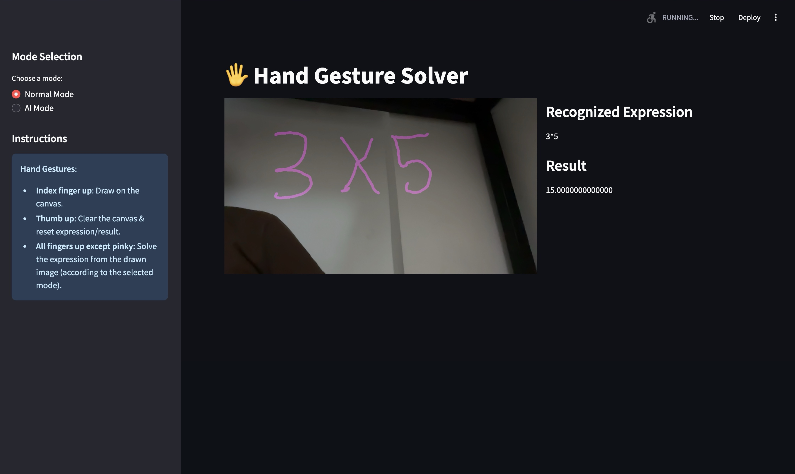

🖐️ Gesture-Based Math Solver
=============================

A real-time application that combines computer vision, hand gesture recognition, and optical character recognition (OCR) to **recognize handwritten mathematical expressions** and solve them effortlessly. Built using **Python, OpenCV, Mediapipe, PaddleOCR, and Streamlit**, this project offers an interactive way to solve mathematical expressions through gestures. It includes an **AI-powered mode** for solving complex expressions with the help of Gemini AI.

🚀 Features
-----------

*   **Hand Gesture Recognition:**
    
    *   Draw on the screen by raising your **index finger**.
        
    *   Clear the canvas by raising your **thumb**.
        
    *   Solve drawn expressions by raising **all fingers except the pinky**.
        
*   **Real-Time Processing:**Combines live webcam feed with gesture-based drawing and mathematical evaluation.
    
*   **Dual Math Expression Solver Modes:**
    
    *   **Normal Mode**:
        
        *   Uses OCR and SymPy for evaluating handwritten mathematical expressions.
            
        *   Handles subscripts, superscripts, and common OCR challenges.
            
    *   **AI Mode**:
        
        *   Leverages Gemini AI for understanding and solving complex mathematical expressions.
            

🔧️ Tech Stack
--------------

*   **Languages:** Python
    
*   **Libraries:**
    
    *   [OpenCV](https://opencv.org/) - Video capture and image manipulation
        
    *   [Mediapipe](https://google.github.io/mediapipe/) - Hand gesture detection
        
    *   [PaddleOCR](https://github.com/PaddlePaddle/PaddleOCR) - Optical character recognition
        
    *   [SymPy](https://www.sympy.org/) - Mathematical expression evaluation
        
    *   [Google Generative AI](https://ai.google/) - Gemini AI for advanced expression solving
        
    *   [Streamlit](https://streamlit.io/) - Interactive user interface
        

📸 How It Works
---------------

1.  **Start the application** to access the webcam feed.
    
2.  **Select a mode**:
    
    *   **Normal Mode** for solving with OCR + SymPy.
        
    *   **AI Mode** for Gemini AI-powered solutions.
        
3.  **Use gestures** to interact with the canvas:
    
    *   Draw mathematical expressions with your finger.
        
    *   Clear the canvas using a thumb gesture.
        
    *   Solve expressions by raising all fingers except the pinky.
        
4.  **Real-time updates** for recognized expressions and results.
    

🔧 Installation
---------------

1.  git clone https://github.com//Gesture-Based-Math-Solver.gitcd Gesture-Based-Math-Solver
    
2.  pip install -r requirements.txt
    
3.  GEMINI\_API\_KEY=your\_api\_key\_here
    
4.  streamlit run main.py
    
 `

🤝 Contributing
---------------

Contributions are welcome! If you have ideas for new features or improvements:

1.  Fork this repository.
    
2.  git checkout -b feature-name
    
3.  Submit a pull request with detailed comments.
    

🤞🏻‍💻 Author
--------------

Varshan AVR

📜 License
----------

This project is licensed under the MIT License. See LICENSE for details.